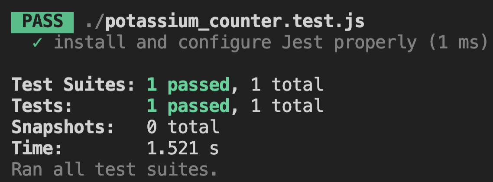
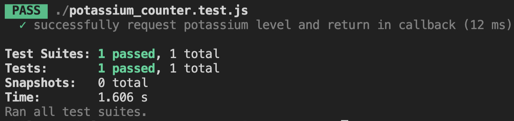
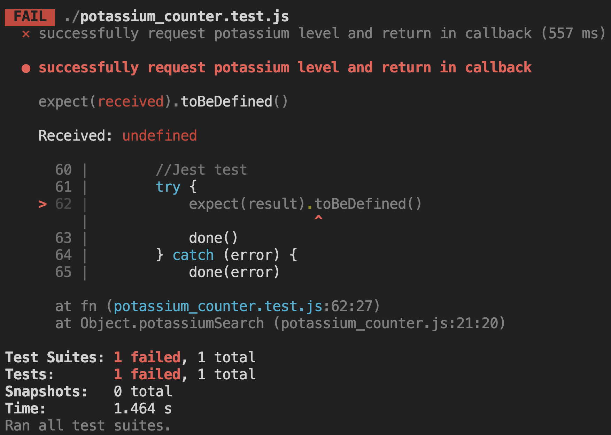
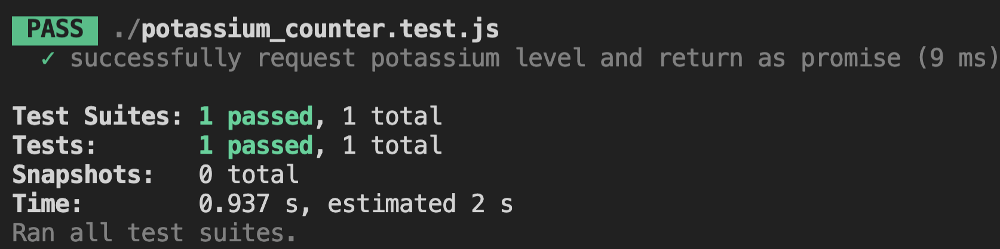
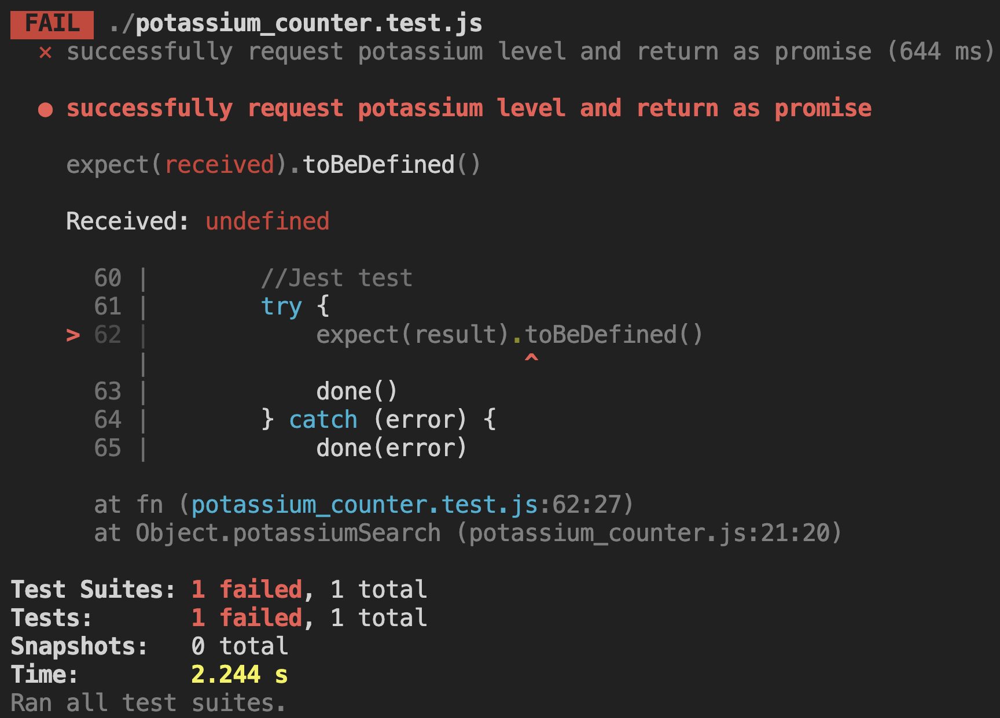
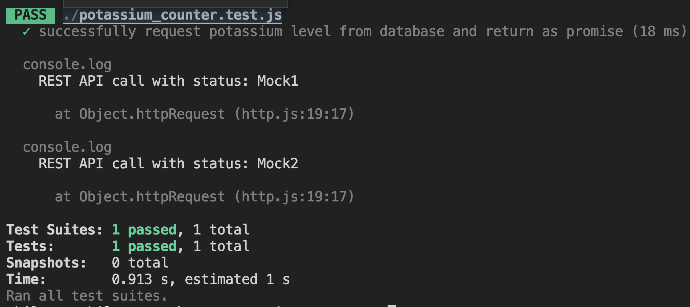

# _Testing With Jest_


## Exercise 1: _What is Jest?_

### Narrative:

As developers, we are always trying to make our code bulletproof from tiny bugs that could completely break our applications. One process that can help us get one step closer to “unbreakable code” is something called "testing." Testing allows us to make sure that our code is behaving the way that we envisioned. Within the realm of testing, there are three major types of tests:

There are three major types of tests:
1. **Unit tests** involve testing fully isolated functions.
2. **Integration** tests involve testing functions with dependencies, for example, a function that calls another function.
3. **End-to-End** tests include testing the entire flow of a project, for instance, validating some type of DOM manipulation.

When it comes to unit tests and integration tests, two fundamental things are needed to perform tests; test-runners and assertion libraries. Test-runners allow us to execute tests and also provide outputted test summaries after. Assertion libraries enable us to check the correctness of our code by adding exceptions to verify defined behaviors. When developing and testing in JavaScript, we can use a JavaScript testing framework called Jest. While there are many testing libraries out there, Jest provides a testing framework that focuses on simplicity. Jest’s framework provides both a test runner as well as an assertion library in one framework allowing us to do a lot right out of the box without much setup. In this lesson, we will analyze and test a language geo-location identifier web app. While doing this, we will explore the wonders of testing with Jest and its ability to expedite the project creation process. 

Let's begin!

<hr>

## Exercise 2: _Setting up Jest_

### Narrative:

Before we can begin testing our code with Jest, it must first be installed and configured. We will download Jest as a node package meaning that we first need to initiate node package manager (a.k.a npm). We will initiate  npm creating a package.json file by running the following command in our terminal:

```bash
npm init -y
```

The above syntax instructs the terminal to create our package.json file while filling in all setup questions with the default answer of "yes". Now that we have a way to manage our node packages, it is time to download and install Jest. We will complete this step with the following code:

```bash
npm install --save-dev jest
```

The following syntax instructs the terminal to download the Jest node package and save it as a developer dependency. Developer dependencies are only relevant during development and not included in the final project build for production. 

Now that we have Jest installed we can write a test script to allows us to run jest tests through npm.

```js
“scripts”:{
“test” : “jest”
}
``` 

With the following steps completed, we can now run tests on all Jest test files by running the command:
```bash
npm test
```
When this command is run in the terminal, Jest searches for files that are either inside of a ```__test__``` directory or any file that ends in either `test.js` or `specs.js`. Once the files are identified, Jest begins running the tests on each file and after provides a terminal output. 


### Instructions:

1. Checkpoint: _Initialize npm, creating a package.json file whose answers have been defaulted to yes._

    Hint: _Run  ```npm init -y``` in the terminal_

2. Checkpoint: _Edit the package.json file to include a test script._

    Hint: _Add ```“test”: “jest”``` to the `” scripts”` object_
3. Checkpoint: _Run test command in terminal to verify_

    Hint: _Run ```npm test``` in terminal_

<hr>

## Exercise 3: _Unit Test With Jest (Part 1)_

### Narrative:

Now that Jest is installed and configured; it is time to set up our first unit test. Let's start with the container that will hold our testing logic, the ```test()``` function. 

The test() function takes three parameters:
1. `"description of desired behavior"`
2. () => {}
3. timeout

The first parameter acts as a way to label and identify the test in the testing output. This is where we describe the tested behavior. The second parameter is a function that will hold the actual test logic; we will revisit this parameter further in the next exercise. The final parameter is an optional timeout represented in milliseconds. This optional parameter defaults to 5 seconds if no value is provided and specifies how long a test should wait before aborting if something is preventing the test from finishing. 

Once we put all of the parameters together, we get the following function:

```test("description of desired behavior", () => {})```

### Instructions:

1. Checkpoint: _Create an empty test function in the language_spoken.test.js file using the syntax covered above._

    Hint: _```test()```_

2. Checkpoint: _Describe the test as ```”my first unit test”```_

    Hint: _The first parameter should be a string that reads, ```“my first unit test”```_
3. Checkpoint: _Declare an empty function for the function that holds testing logic_

    Hint: _The second parameter should be ```()=>{}```_
4. Checkpoint: _Declare the function using the default timeout_

    Hint: _The third parameter should be left blank._

## Exercise 4: _Unit Test With Jest (Part 2)_

### Narrative:

With our test() function container setup, it is time to finish our first unit test. Jest offers an intuitive and easy-to-set-up testing syntax that provides a smooth transition between lamens terms and jest testing logic. Let's take, for example, an application that can tell you how many milligrams of potassium a list of food contains, we’ll call it “potassiumCounter”. As we begin testing this application, we will want to make sure that each of its individual functions works properly. We will start by testing the ```itemExtractor()``` function. We expect this function to receive an entered list in the form of a string and output it as an object. Below we can see this expected behavior translated into the jest testing syntax:

```js

//file: potassium_counter.test.js
const potassiumCounter = require('./potassium_counter')

test('transform entered list from string to object', () => {
   //Setup
   const input = '1 taco, 2 pancakes, 3 hamburgers'
   const expectedValue = {
       'taco': 1,
       'pancakes': 2,
       'hamburgers': 3
   }
   const value = potassiumCounter.itemExtractor(input)
 
   //Jest Test Logic
   expect(value).toEqual(expectedValue)
})

```
Analyzing the syntax, we can see that the translated test statement lives within the second parameter of the test function. Inside that function, we can see that the test logic begins with the ```expect()``` function. The expect function() is used every time that we want to write a test. However, this function is rarely used alone. It can almost always be found in conjunction with matchers, for example, ```.toEqual()```. The ```.toEqual()``` matcher is used to perform deep equality comparisons. There are quite a few different matchers, and we will cover them more in the next exercise.

### Instructions:

1. Checkpoint: _Below the ```//Jest Test Logic```  use the ```expect()``` function to define what value we expect to test_

    Hint: 
    ```js
    expect(response)
    ```

2. Checkpoint: Directly after the expected value use a matcher to define what value is expected to be equal to the tested value_

    Hint:
    ```js
     toEqual(expected)
     ```
3. Checkpoint: _Run test in terminal_

    Hint: _Run ```npm test```_

## Exercise 5: _Matcher Functions_

### Narrative:

Now that we have written our first complete unit test, let us break down five more matchers. We will analyze a test written to test the ```sumList()``` function whose expected behavior is to take in an array of numbers and to output a single number representing the summation of the array items. To test  the ```sumList()``` function we will use five matchers: 
```js
//file: potassium_counter.test.js
const potassiumCounter = require('./potassium_counter')
 
test('add all potassium', () => {
   //setup
   const inputList = [1, 2, 3]
   const expectedValue = 6
   const value = potassiumCounter.sumList(inputList)
   //Jest Test Logic
   expect(value).toBe(expectedValue)
   expect(value).not.toContain(6)
   expect(value).toBeTruthy()
   expect(value).toBeDefined()
})
```
Matchers Used:

1. **.toBe()** is similar to .toEqual() but is used to compare primitive values.
2. **.not** is used in addition to another matcher to verify that the opposite result is true
3. **.toContain()** is used when we want to verify that an item is in an array
4. **.toBeTruthy()** is used to provide a boolean response to the verification of whether a value is truthy or not 
5. **.toBeDefined()** is used to verify that a variable is not ```undefined``` 

As mentioned in the previous lesson, there are many different matchers and the complete list can be found in the [Jest documentation](https://jestjs.io/docs/expect).


### Instructions:

1. Checkpoint: _Rewrite the test switching the matcher with one of the five matchers that we covered, to test that the value should be 6._

    Hint: _Try replacing ```.toEqual()``` with ```.toBe()```_

2. Checkpoint: _Run test in terminal_

    Hint: _Run ```npm test```_

## Exercise 6: _Testing Async Code in Jest (Part 1)_

### Narrative:

Armed with how to write simple unit tests, we will now add a layer of complexity to our tests. We will explore testing asynchronous code in Jest. When testing async code in Jest, we have to be aware of "false positives". False positives occur when a test passes before waiting for a callback to resolve. By default, Jest is not aware that it must wait for callbacks to resolve before finishing a test. Let's test the following function that calls to a REST API and returns a callback with the data:
```js
//file: potassium_counter.test.js
const potassiumCounter = require('./potassium_counter')
 
test('successfully request potassium level and return in callback', () => {
   //setup
  const inputFood = null
  const value = potassiumCounter.potassiumSearch(inputFood, result => {
       //Jest test
        expect(result).toBeDefined()
      })
})
``` 
Let’s see what happens when we try and get the potassium levels of ```null```:
 


Notice how the test passes even though it shouldn't. There are a few ways to fix this issue. We will begin with the ```done()``` callback provided by Jest. When called, the ```done()``` callback signifies that the test should not finish until the asynchonous code has completed its behavior. The implementation of the ```done()``` callback to fix the false positive problem looks like this:

```js
test("successfully request potassium level and return in callback"), (done) => {
   //setup
  const inputFood = null
  const value = potassiumCounter.potassiumSearch(inputFood, result => {
       //Jest test
       try {
           expect(result).toBeDefined()
           done()
       } catch (error) {
           done(error)
       }    
   })
})
```


As you can see the test is now functioning as expected and will not pass until ```inputFood``` is passed defined as a valid argument for the ```potassiumSearch()``` function.


### Instructions:

1. Checkpoint: _Run test to identify if it is returning a  false positive_

    Hint: _Run ```npm test```_

2. Checkpoint: _Using the example above as a reference rewrite the asynchronous test using the `done()` callback._

    Hint: _ ```done``` should be passed as a parameter and the test syntax should include:
```js
        try {
        expect(result).toBeDefined()
        done()
        } catch (error) {
            done(error)
        }
```

3. Checkpoint: _Run test to verify that the tests do not pass and that the false positive problem has been fixed_

    Hint: _Run ```npm test```_

## Exercise 7: _Testing Async Code in Jest (Part 2)_

### Narrative:

As mentioned before, there are different ways beyond the ```done()``` callback to properly perform tests on asynchronous code. We will now explore testing functions that return a promise instead of a callback function. Let’s use the same function as before altering it slightly. Instead of returning a callback with the data, the function will now simply return a promise. We will run the same test as before but this time without the done parameter to recreate the false positive problem:
```js
test('successfully request potassium level from database and return as promise', () => {
   //setup
  const inputFood = null
  const value = potassiumCounter.potassiumSearch(inputFood)
       //Jest test
  expect(value).toBeDefined()  
})
```
Now let’s run the test to verify that we get a false positive:
 


We will fix the false positive this time by using the async/ await syntax:
```js
test('successfully request potassium level from database and return as promise', async() => {
   //setup
  const inputFood = null
  const value = await potassiumCounter.potassiumSearch(inputFood)
   //Jest test
     expect(result).toBeDefined()
            
})
```
Now let’s run the test to verify that the false positive problem has been fixed:



This syntax works by placing the ```async``` before the parameter parentheses, this transforms the function into an async function. This means, that whenever the word ```await``` is placed before a function within the async function, that it must wait until it returns before moving on down the call stack. 


### Instructions:

1. Checkpoint: _Run test to identify if it is returning a  false positive_

    Hint: _Run ```npm test```_

2. Checkpoint: _Using the example above as a reference rewrite the test using the `async/await` syntax._

    Hint: _The testing function should begin with the indicator ‘async’. The ‘await’ indicator should come before any function that needs to return before moving on down the call stack._


3. Checkpoint: _Run test to verify that the tests do not pass and that the false positive problem has been fixed_

    Hint: _Run ```npm test```_

## Exercise 8: _Mocking in Jest (Part 1)_

### Narrative:

When it comes to creating “good tests”, it is important to first stop and ask ourselves, what behavior are we specifically trying to test. Over the past examples, we have been analyzing the `potassiumSearch()` function which includes a REST API call. Testing in this manner is not ideal because what we care about is not so much that the third-party API works, but that the behavior with the returned values from that call works. Incorporating REST API calls into our tests can create fragile tests that may fail simply due to network issues. Also, it could cause problems if we were interacting with a production-grade database as we could accidentally alter official data. A better and more efficient way to write our tests would be to bypass the REST API call and mock the return values. Luckily, Jest provides us with a way to mock functions and even modules. Let’s take our previous function used to retrieve potassium info and walk through the steps to create a mock function and to mock the Axios module to replace the REST API call. For the sake of clarity, we will break down this process over this exercise and the next. 

To create a mock module (Part 1):
1. Create a directory labeled `__mocks__`
    - Jest is set up to search and use mock files that reside in a `__mocks__` directory.
2. Inside the directory, create a file with the same name as the module that will be mocked. 
    - We want to bypass the Axios module that is making the call to the REST API so we will label the file `axios.js`.
3. Create and export a mock function with the functionality that we want to mock.
    - As mentioned we are going to mock the Axios post method, which returns a promise.
```js
module.exports = {
       post: jest.fn(()=>{
                return Promise.resolve({ status:'', data: {} })
       })
}
```

Notice that the `post` method is comprised of a `jest.fn()`. This function is provided by Jest and allows us to use special matchers when testing with mocks. There are many different matchers that can only be used with respect to `jest.fn()` and a full list can be found in the [Jest  documentation](https://jestjs.io/docs/mock-function-api). This mock function will now take the place of `axios.post()` within `potassiumCounter()` 
 


### Instructions:

1. Checkpoint: _Inside the directory labeled `__mocks__`, identify the file labeled,   `axios.js`  and create a module that exports a `get` function._


2. Checkpoint: _Create the `get` function to be a `jest.fn()` function_

    Hint: _The testing function should begin with the indicator `async`. The `await` indicator should come before any function that needs to return before moving on down the call stack._


3. Checkpoint: _Inside the `jest.fn()` define a function that  returns a resolved promise._

    Hint: 
    ```js
    module.exports = {
   get: jest.fn(() => Promise.resolve({
       status: ``,
       data: []
   }))}
   ```
## Exercise 9: _Mocking in Jest (Part 2)_

### Narrative:

Now that we have a mock module set up it is time to use it within our Jest test.

Steps to implement mock function (Part 2):
1. In the `potassium_counter.test.js` file, require the module that we are going to mock and call `jest.mock()` to instruct Jest to override the required module with the mock one. 
```js
const potassiumCounter = require('./potassium_counter')
const axios = require('axios')
jest.mock('axios')
```

2. Modify the Jest to leverage the mock function
```js
test('successfully request food info', async() => {
 
 const resp1 = {
       status: `Mock1`,
       data: { foods: [{ nf_potassium: 184.04 }] }
   };
   const resp2 = {
       status: `Mock2`,
       data: { foods: [{ nf_potassium: 164.22 }] }
   };
 
 axios.post.mockResolvedValueOnce(resp1).mockResolvedValueOnce(resp2);
  
   //setup
   const inputFood1 = 'pizza'
   const inputFood2 = 'taco'
   const expectedValue1 = 184
   const expectedValue2 = 164
   const value1 = await potassiumCounter.potassiumSearch(inputFood1)
   const value2 = await potassiumCounter.potassiumSearch(inputFood2)
       //Jest test
           expect(value1).toBe(expectedValue1)
           expect(value2).toBe(expectedValue2)
   })
``` 
- As mentioned before, a mock function created with ` jest.fn()` comes with unique matchers. One of these matchers is `.mockResolvedValueOnce()`, which accepts a value to be returned for one call to the mock function. Since we have two `.mockResolvedValueOnce()` functions chained together, the mock function is called twice with two different values. So the first time that we `expect()` a value it will be the value from the first `.mockResolvedValueOnce()` and the second time, the value will come from the second `.mockResolvedValueOnce()`.
3. Run test to make sure that mock is running and not the real axios.post function  



### Instructions:

1. Checkpoint: _At the top of  the language_spoken.test.js file, require the axios module and notify jest that axios will be mocked_

    Hint: _```jest.mock('axios')```_

2. Checkpoint: _Analyze and run the modified test_

    Hint: _```npm test```_


## Exercise 10: _Let's Review_

### Narrative:

We have covered a lot over this lesson. We have learned that Jest is a framework perfect for testing in a JavaScript environment. We also learned some of the basic syntax involved with creating a simple unit test. After tackling basic unit tests we adventured into the realm of test asynchronous code with Jest and even mocked the Axios module.  While we have learned a lot there is always more knowledge to be obtained and I encourage you to not let your relationship with Jest stop here! 
